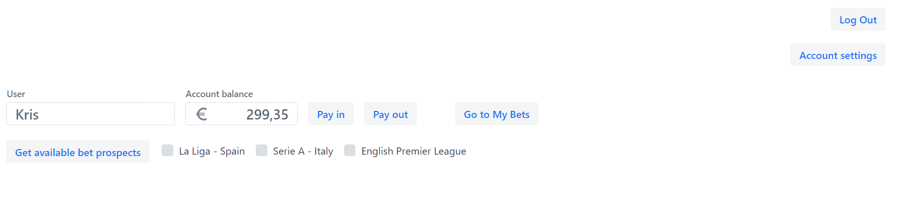
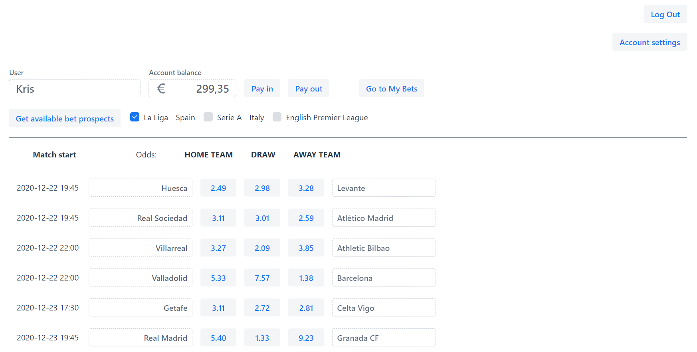
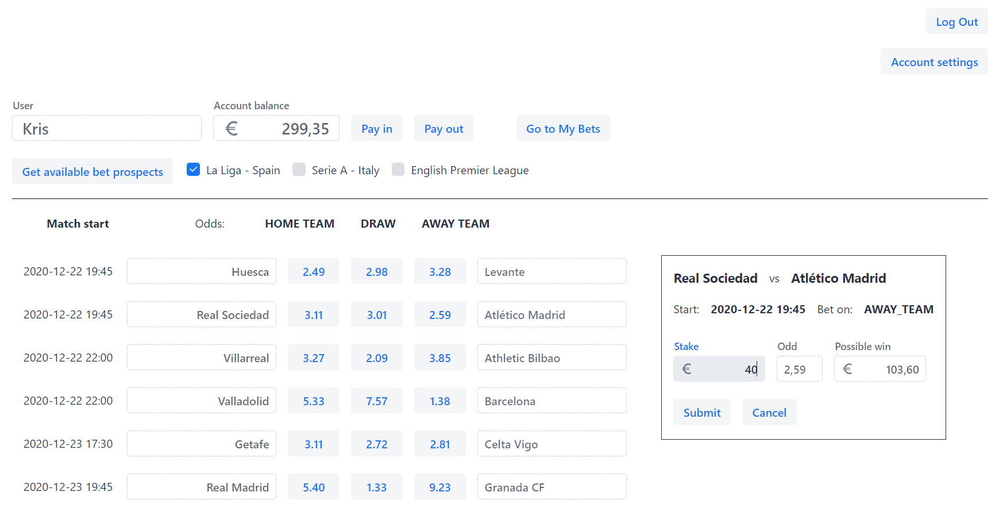
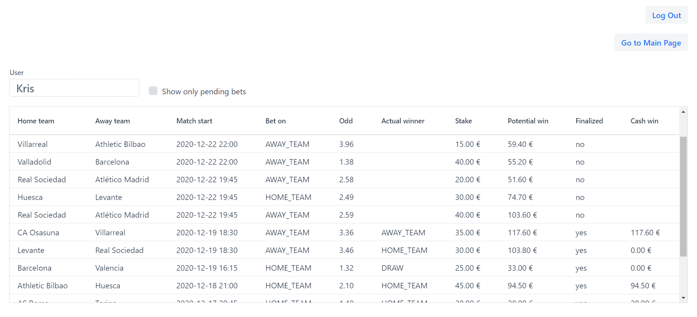
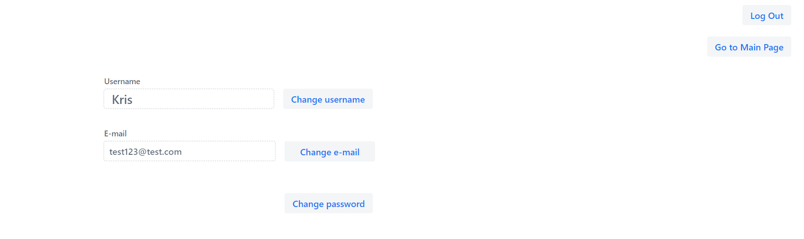

# BestBetsApp - frontend

[Link to backend app](https://github.com/napiorkowskik83/bets)

Application is using local server port 8081.
It starts by running main method in BetsVaadinApplication class.

BestBetsApp allows users to play virtual sport betting.
Application generates odds by averaging odds from several betting sites.
It automatically settles users' bets based on actual match results.

Before entering main page, application requires logging in (using username or e-mail as login).
If user doesn't have an account, he has to sign up.

'Sign Up' button redirects to page where you need to enter:
- at least 3 character long unique username
- unique e-mail
- at least 5 character long password
- day of birth (user must be at least 18 years old)

After successful logging in / signing up, user is redirected to the main page.
User can see there his current account balance.
Using corresponding buttons user can make virtual pay in or pay out and change the balance.

When clicking 'Get available bet prospects' button, application uploads and displays list of possible bets on upcoming games.
(Currently available options: matches from Serie A - Italy, La Liga - Spain and English Premier League). 

By clicking corresponding buttons with odds, user can generate bet options with home team, draw or away team as a tipped winner.
To submit the bet user have to enter a stake which can not exceed his current balance. 

Successfully submitted bets are listed in 'My Bets' page.
User can try to delete not finalized bet by clicking on its line. 
Bets can be deleted only before match start time.  

When clicking 'Account settings' button on the main page, user is redirected to his data page.
User have there possibility to change his username, e-mail or password.

